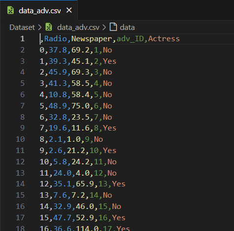
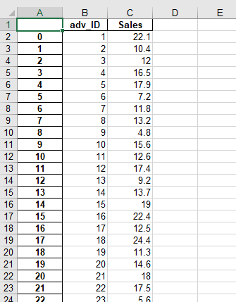
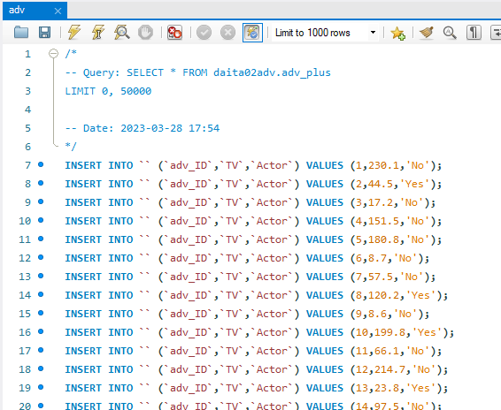
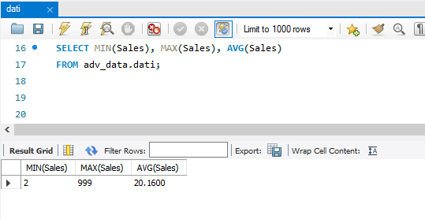
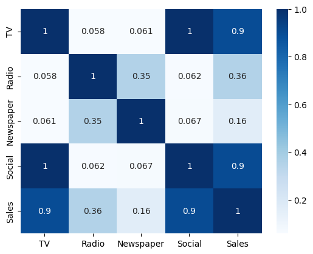
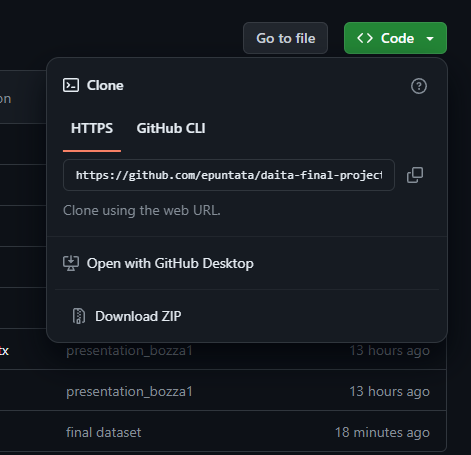

<p align="center">
  <a href="" rel="noopener">
 </a>
</p>
<h3 align="center">Pubblicità</h3>

<p align="center"> Un progetto di data engineering per l'analisi di pubblicità
  <br> 
</p>

---

## 📝 Indice <a name = "indice"></a>

- [Problema](#problem_statement)
- [Soluzione](#idea)
- [Limitazioni](#limitations)
- [Utilizzo](#usage)
- [Tecnologie Utilizzate](#tech_stack)
- [Autori](#authors)
- [Riconoscimenti](#acknowledgments)

## 🧐 Problema <a name = "problem_statement"></a>

Il cliente ha richiesto l'analisi di alcuni dati per capire quanto vale la pena investire in pubblicità, e quali canali sono i più appropriati.
<p align="right">(<a href="#indice">back to top</a>)</p>

## 💡 Soluzione <a name = "idea"></a>

Per analizzare i dati, abbiamo sviluppato una pipeline per portare i dati dai file originali alla nostra dashboard in PowerBi, dove possiamo mostrare i risultati delle nostre analisi.

### Ricezione dei file

Abbiamo inizialmente ricevuto 4 file di formati diversi: due file CSV, un file XLS, e un file SQL.

| CSV | XLS | SQL |
| --- | --- | --- |
|  |  | 

Ad una prima occhiata, appare possibile combinare tutti i dati in un singolo dataset; la possibilità è stata esplorata con l'aiuto di Python.

### Python e Jupyter: una ETL

Per prima cosa, dovevamo velocemente testare come poter leggere i file: a questo scopo è stato creato il notebook [01_data_collection](./01_data_collection.ipynb) per aprire, leggere e trasformare i file.

Dopo aver testato una possibile soluzione con tale notebook, è stato creato un file Python [02_ETL_pipeline](./02_ETL_pipeline.py) per astrarre ed eventualmente automatizzare l'operazione, nel caso ricevessimo nuovi file, o nel caso i file che abbiamo venissero aggiornati.

### Data Lake

Una volta ottenuto il nostro dataset finale [result](./result.csv), abbiamo creato un database MySQL per salvare i nostri dati. I comandi per la creazione di tale database si possono trovare nel file [03_database](./03_database.sql).

Da questo database possiamo ora eseguire query; ad esempio, la query:

```SQL
SELECT MIN(Sales), MAX(Sales), AVG(Sales)
FROM adv_data.dati;
```

Restituisce la seguente tabella:
  
| MIN(Sales) | MAX(Sales) | AVG(Sales) |
| --- | --- | --- |
| 2 | 999 | 20.1600 |



### Data exploration

Tornando su Jupyter, abbiamo esplorato il nostro dataset ([04_data_exploration](./04_data_exploration.ipynb)) usando librerie Python come Seaborn e Matplotlib per vedere in forma grafica quali potessero essere eventuali relazioni tra le variabili.

Ad esempio, abbiamo prodotto una heatmap che mostra chiaramente un alta correlazione tra le vendite (Sales) e il budget per la televisione (TV); potrebbe valere la pena esplorare meglio questa relazione.



### Data Science (R)

?

### PowerBI

Usando PowerBI abbiamo caricato i dati e tramite Power Query ripuliti dai dati anomali riscontrati nelle prime analisi fatte.

Procediamo poi ad effettuare varie analisi grafiche riportando quelle più significative Es. la suddivisione delle spese e del fatturato.

| Dato Anomalo in evidenza | Data Cleaning con Power Query |
| --- | --- | 
|  | 

<p align="right">(<a href="#indice">back to top</a>)</p>

## 🚩 Limitazioni <a name = "limitations"></a>

- La quantità di spunti di riflessione rilevanti per il business è stata inferiore alle previsioni; forse il dataset era troppo piccolo (solo 200 righe), o forse mancavano dati aggiuntivi che potessero aggiungere profondità alla ricerca.

<p align="right">(<a href="#indice">back to top</a>)</p>

## 🎈 Utilizzo <a name="usage"></a>

### Per vedere la dashboard in PowerBI

Scaricare il file adv.pbix dalla cartella [PowerBi](./PowerBi)

### Per eseguire il codice

Scaricare il contenuto della repository come file ZIP.



Decomprimere il file nella cartella desiderata, poi aprire la cartella in Visual Studio Code. Potrebbe essere necessario installare alcune estensioni per aprire e/o eseguire alcuni tipi di file (es file Jupyter)

<p align="right">(<a href="#indice">back to top</a>)</p>

## ⛏️ Costruito con <a name = "tech_stack"></a>

-  - Testing
-  - Creazione ETL
-  - Database
-  - Data Science
-  - Data Visualization

<p align="right">(<a href="#indice">back to top</a>)</p>

## ✍️ Autori <a name = "authors"></a>

- Baldoni Eugenia
- Scrima William
- De Cales Giovanni
- Rossi Eleonora
- Anas Chaya
- Roma Marco
- Murgo Francesco

## 🎉 Riconoscimenti <a name = "acknowledgments"></a>

- Grazie a Generation Italy per il corso di Junior Data Engineer, senza il quale non avremmo realizzato questo progetto
- Grazie a Christian Iozzi per averci ispirati

<p align="right">(<a href="#indice">back to top</a>)</p>